# Estimation Project

### Step 1
For this step I ran the simulator and obtained the Graph txt files.
I ran a quick pandas analysis in Jupyter Notebook as seen below and I extracted
the mean and the standard deviation for the GPS and th eIMU.

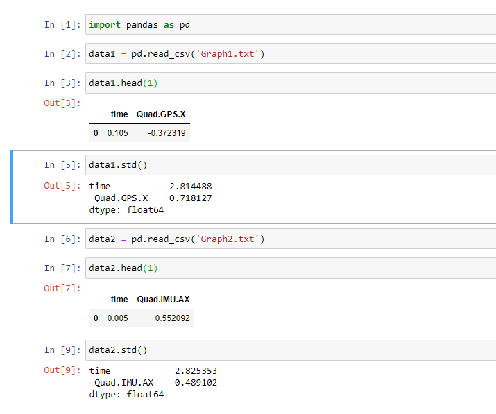

Running the simulation with those new updated values I obtained the
following performance:

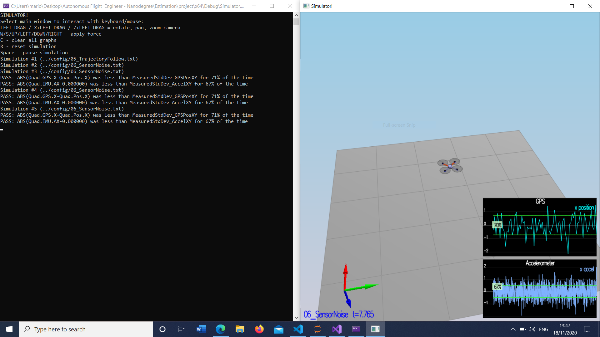

### Step 2

For this step I implemented the IMU update of the estimator.
The code appears below. We make use of the quaternion and the
method provided by the class. Then we extract the Roll, Pitch and Yaw.

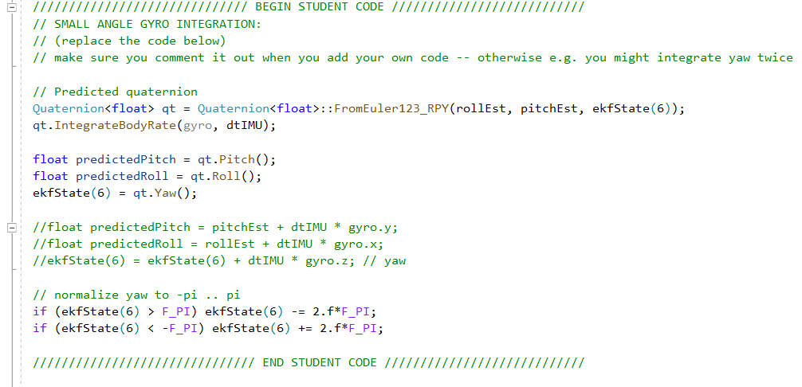

The performance obtained with the better integration scheme is shown below.

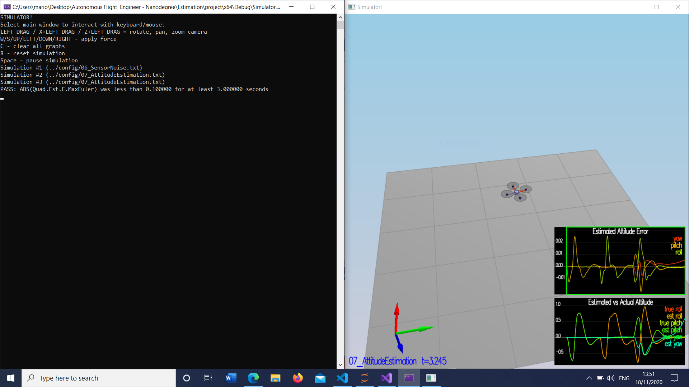

### Step 3

For this step I implemented the state prediction step:

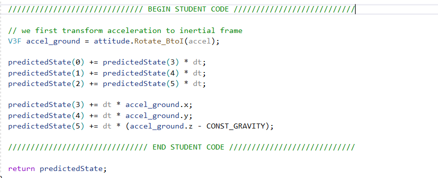

And the estimator could accurately track the actual state, with a slow drift.

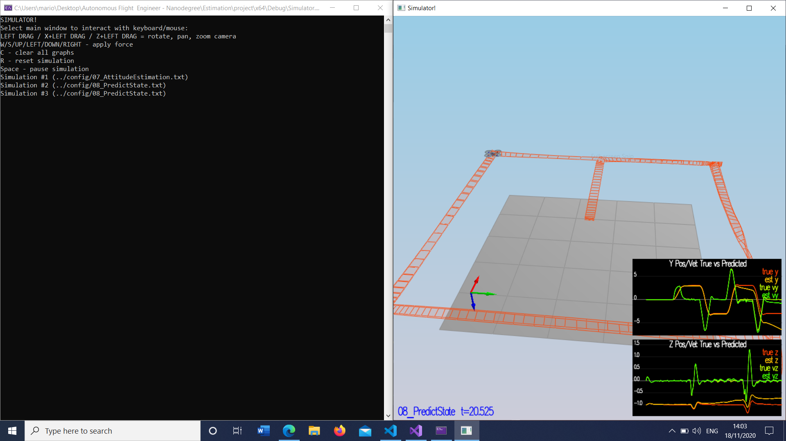

After introducing the realistic IMU with noise as per the instructions,
I implemented the Rgb prime function

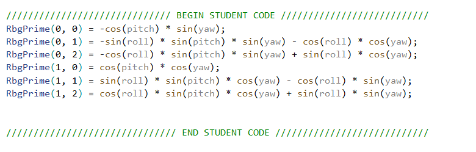

and the Predict step:

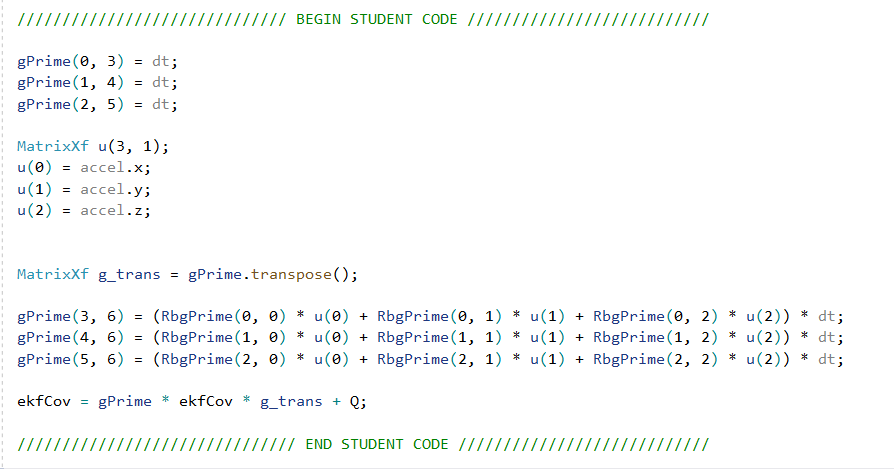

Modifying the  gains I could see that the covariance grows like the data:

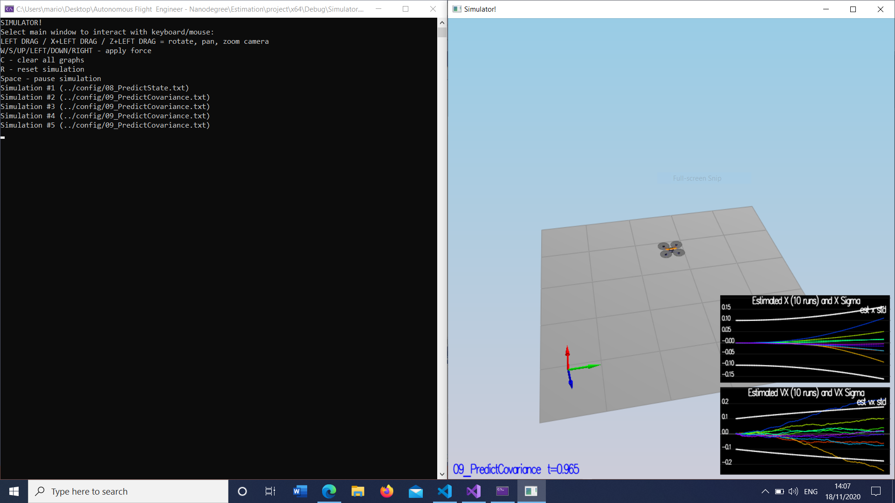

### Step 4

In this step I implemented the function that uses the magnetometer for the yaw updates

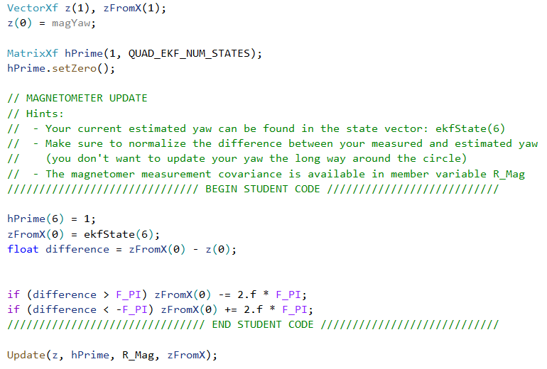

and th eoutput was as follows, passing the criteria.

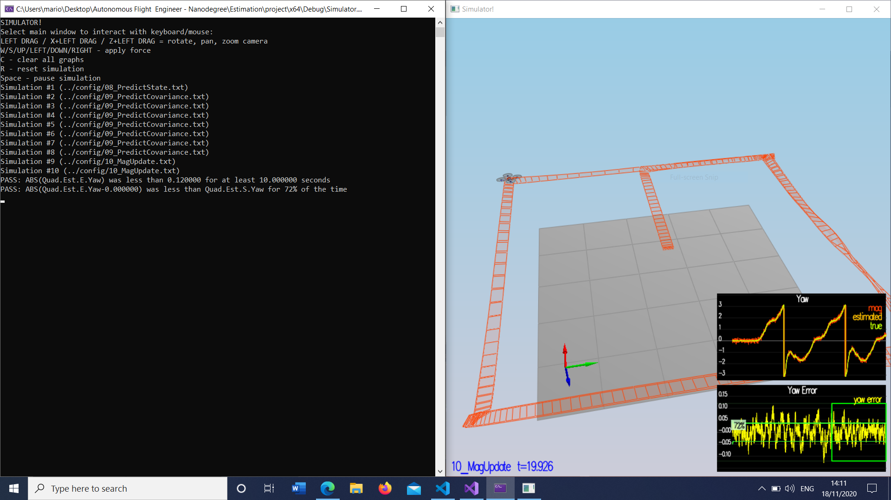

### Step 5

In this step, I implemented the GPS update function (simple Implementation
of the document equations)

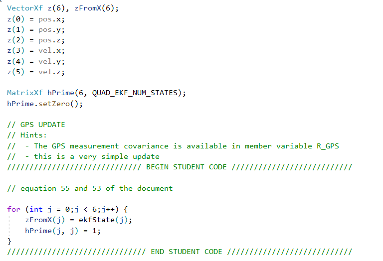

After tuning, we get the following:

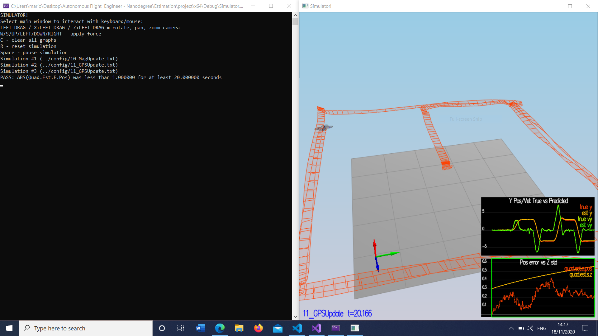

### Step 6

Overall, after inserting the controller of the previous project and fine tuning (It was't necessary), the drone is able to fly and pass the criteria as required.

